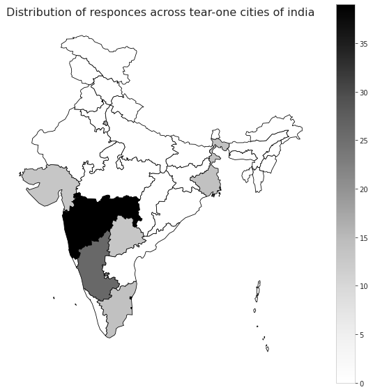
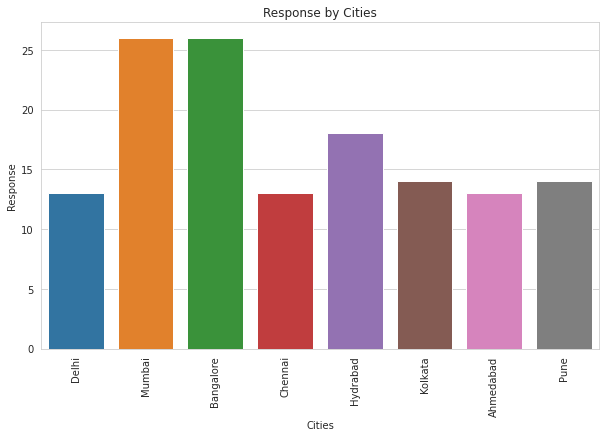
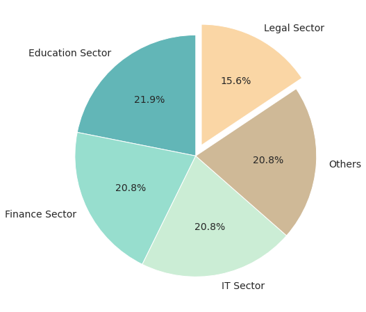
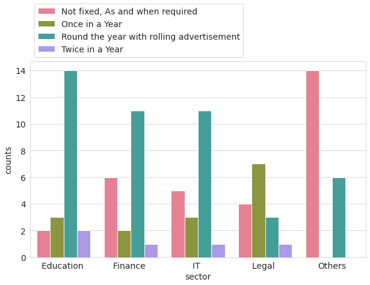
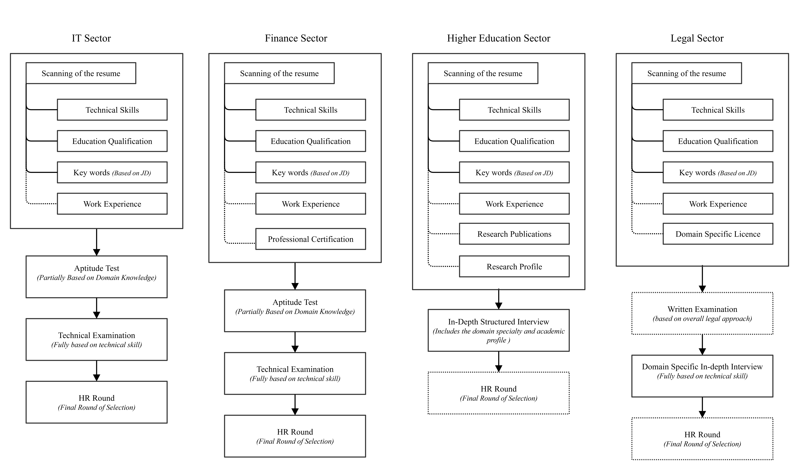
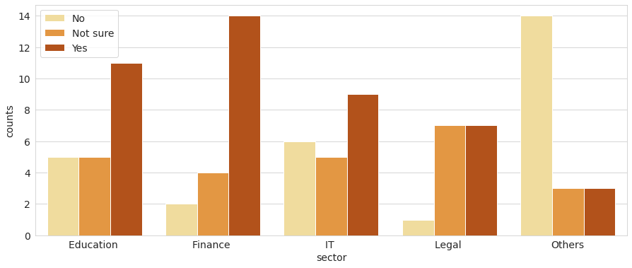
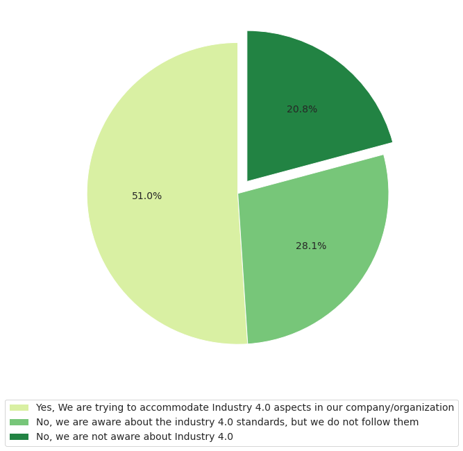
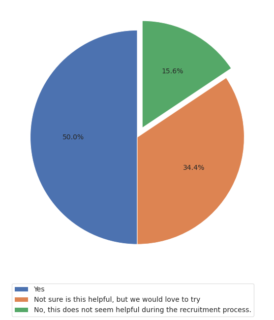
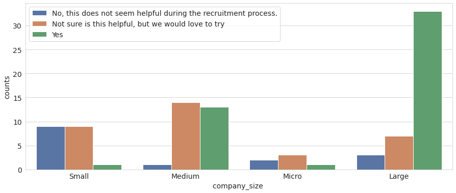

<h1>Industrial Survey For Recruitment Process</h1>
<ul>
    <li>The survey is conducted for tier-1 cities of India – Delhi, Mumbai, Bangalore, Chennai, Hyderabad, Kolkata, Ahmedabad, and Pune)</li>
    <li>This survey is targeted to collect data from IT, Finance, Legal and Higher Education sectors. (Though, we received good response from other sectors like Pharma, Consultancies, Event Management, Manufacturing and treading Sectors)</li>
</ul>

The distribution of the responses is represented in Figure-1 and Figure-2. As we can observe in Figure-1 State Maharashtra shows the highest responses, because two cities, Mumbai and Pune falls under Maharashtra. Thus, the cumulative responses from both the cities are displayed in Maharashtra.

<table>
  <tr>
    <td>Cartogram represents the distribution of the responses - state wise distribution</td>
    <td>Bar plot represents the distribution of responses - city wise distribution</td>
  </tr>
  <tr>
    <td></td>
    <td></td>
  </tr>
 </table>

To see the independent responses of the cities, refer Figure-2. It shows frequency of responses from individual city. The data points in this plot does not have any outliers, so we do not have any bias in the demographic data.

<h3>Industry sectors Distribution</h3>

<table>
  <tr>
    <td width=60%>
Here we receive average 19.98 % response from each sector which we considered for industrial survey. So according to the pattern the data is no biased in terms of sectors. (Median for the same is 20.8 – Thus there are no outliers in the data which can affect the mean.) Here “Other” sector includes the Pharma, Consultancy, import-export, Manufacturing, and many other sectors.
</td>
    <td></td>
  </tr>
 </table>
 
<h3>Recruitment Pattern</h3> 

<table>
  <tr>
    <td></td>
    <td width=60%>
The data is collected to check the recruitment pattern of the organization sector-wise. Figure-4 shows distribution for attempts of number of recruitments in the organization according to sector.There is a clear visibility of ‘Round the year recruitment process’ in Education, Finance, and IT sector. For legal sector once in a year recruitment seems enough and in other sectors it is based on the requirement. Thus, majority of the organizations are now flexible with the recruitment timings. So, in the market there is no season of recruitment.

</td>
  </tr>
 </table>
 
 <h3>Recruitment Process</h3>
 
All the defined sectors have little difference in recruitment process and currently there is no specific scanning process which check the competency of the candidate. Thus, this shows the clear market requirement of system which can accurately identify the competencies from the resumes – which can be plugged into this already defined system

 
<h3>Top Criteria to scan the resumes</h3>

During the recruitment process criteria of scanning the resume is important and base step in the whole process. Following are the criteria(s) picked by majority of the companies during the survey.

<ul>
    <li>Analyse the qualities and traits of top performing employees currently in the role</li>
    <li>Define the criteria for minimum education qualification based on job description.</li>
    <li>Define the criteria for minimum technical skill set based on job description.</li>
    <li>Define the criteria for additional technical skill set based on job description</li>
    <li>Analyse the previous work experience from the resume</li>
</ul>

Apart from these general criteria picked by companies from all the sectors. Some criteria are also added by some specific sectors, following is the summery of the criteria considered according to the sector’s requirements and priorities.

<ul>
    <li>Finance Sector: Consider the candidate’s background with the previous company and the background of the higher education college (like check-out the candidates from IIMs and IITs)</li>
    <li>Legal Sector: Individual practicing records, Goodwill in the market and Licences if any.</li>
    <li>Education: Research Publications of the candidates</li>
</ul>

<h3>Identification of keywords in the organizations</h3>

<table>
  <tr>
    <td></td>
    <td width=60%>
As shown in the Figure-9, Education Sector, Finance Sector, and IT Sector is trying to pre-decide keywords before rolling out any job position. Only companies which falls in another categories shows the response that they are not sensitive about fixing keywords before starting the recruitment process.
</td>
  </tr>
 </table>
 
 <h3>Do Companies follow the 4IR/Industry 4.0 standards?</h3>
 
 <table>
  <tr>
    <td width=60%>
    
As Shown in Figure-10, 51% of the companies are trying to accommodate 4IR/Industry 4.0 competencies and 28.1% of the companies are aware about it but currently not following the standards. These 28.1% of the companies are potentially looking forward for solutions which can help them to step into 4IR standards. And 51% of the companies are looking forward for the solutions which can help them adopting smoothly from our sample.

    
Thus, we can conclude that majority of the companies are following 4IR standards and willing to use systems which accommodate 4IR/Industry 4.0 approach.

    </td>
    <td></td>
  </tr>
 </table>
 
 <h3>Market Response for proposed system:</h3>
 
 <table>
  <tr>
    <td></td>
    <td width=60%>
    
As shown in Figure-11, 50% of the companies are positive and sure about the proposed system, that this system is useful for them.  34.4 % of the companies are positive about the system but they are not sure about the utility of the system, they would like to use the proposed system and experience the process. 15.6% of the companies believe that this system is not useful for them.

    
If we dig one more layer of this aspect in the survey, we can see the approach of the organizations towards our proposed system based on organization’s size.

    </td>
  </tr>
 </table>
 
 
The further analysis says that only the companies fall under the cap of “Micro sized company” does not find this system useful. So, the target users of our system are “Small sized companies”, “Medium sized companies” and “Large sized companies”.

 
 
